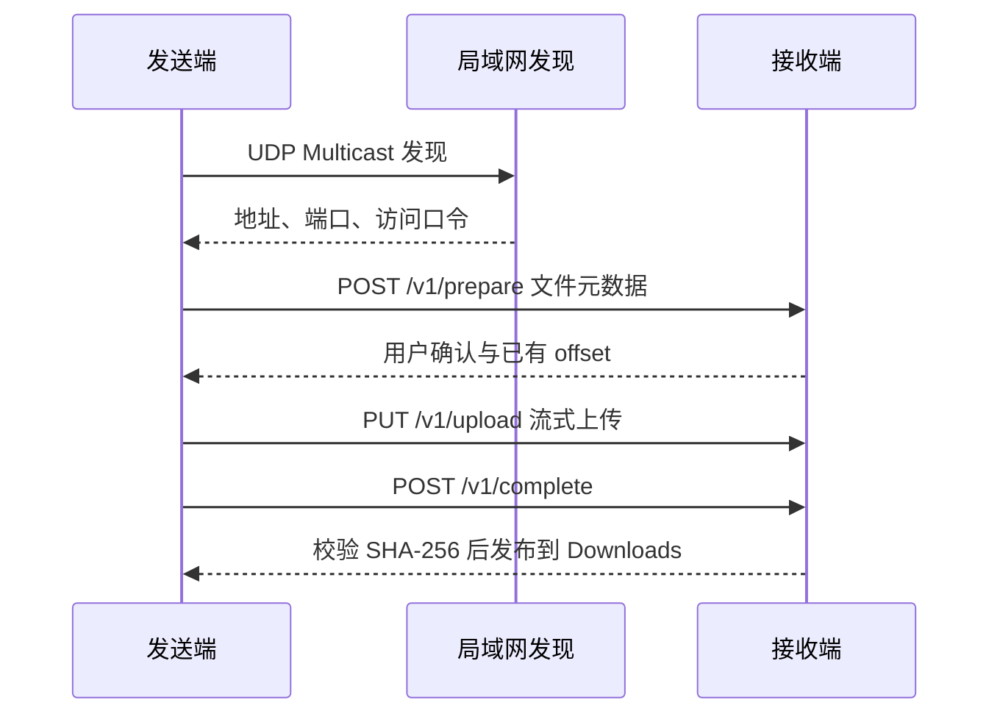

# LanShare MVP

<p align="center">
  <strong>Android 局域网文件分享</strong><br />
  <sub>从系统分享菜单发送文件到同一局域网内的另一台 Android 设备</sub>
</p>

<p align="center">
  
  
  
  
</p>

LanShare 是一个面向 Android 设备的局域网文件传输 MVP。发送端和接收端使用同一个 APK，通过局域网发现或手动连接建立传输，文件只在设备之间直接流转，不依赖云服务器、账号或互联网中继。

当前版本为 `0.1.0-mvp`，重点验证一条可审计的文件传输链路：**系统分享 → 设备发现 → 接收确认 → 流式传输 → SHA-256 校验 → 写入 Downloads**。

## 目录

- [项目定位](#项目定位)
- [功能概览](#功能概览)
- [快速使用](#快速使用)
- [构建与安装](#构建与安装)
- [工作原理](#工作原理)
- [协议概览](#协议概览)
- [项目结构](#项目结构)
- [验证状态](#验证状态)
- [安全边界与已知限制](#安全边界与已知限制)
- [路线图](#路线图)
- [参与贡献](#参与贡献)
- [许可证与致谢](#许可证与致谢)

## 项目定位

LanShare 只解决一个明确问题：在同一局域网内，把手机或其他 Android 设备上的文件快速发送到另一台 Android 设备。

- **单 APK 双角色**：同一个安装包既可以发送，也可以接收。
- **系统分享优先**：在文件管理器、相册等应用中直接通过 Android 分享菜单发送。
- **局域网直连**：使用 UDP Multicast 自动发现，发现失败时支持手动输入地址。
- **接收端可控**：接收请求必须由用户确认，不会静默写入文件。
- **可靠性优先**：流式传输、进程内断点续传、完整 SHA-256 校验和失败不落盘。

项目明确不包含云端存储、账号体系、广告、互联网穿透、iOS 客户端和音乐在线播放等能力。

## 功能概览

| 领域 | 当前能力 |
| --- | --- |
| 发送入口 | 支持 `ACTION_SEND`、`ACTION_SEND_MULTIPLE`；支持 App 内一次选择多个文件 |
| 文件来源 | 直接消费 Android `content://` URI，不依赖真实文件路径 |
| 设备发现 | UDP Multicast `224.0.0.167:53317` 自动发现 |
| 手动连接 | 支持 IP、实际服务端口和 4 位数字访问口令 |
| 接收控制 | 接收端显示请求并人工确认，拒绝后发送端明确失败 |
| 传输方式 | HTTP 流式传输，使用 1 MiB 缓冲区，不将整文件加载到内存 |
| 断点续传 | 同一 `sessionId` 内由接收端根据 `.part` 文件长度决定 offset |
| 完整性校验 | 发送端提供 SHA-256；接收端校验字节数和 SHA-256 后才算成功 |
| 文件落盘 | 校验通过后写入 `Download/LanShare`，失败文件不会发布到正式目录 |
| 后台运行 | 使用前台 Service 维持接收服务和发现服务 |
| UI | Jetpack Compose；支持窄屏单列和宽屏双栏布局 |

## 快速使用

### 使用前准备

- 两台 Android 10（API 29）或更高版本的设备。
- 两台设备连接到同一个 Wi-Fi，或让接收设备连接发送设备的热点。
- 接收设备和发送设备都安装同一个 LanShare APK。

### 发送文件

1. 在两台设备上打开 LanShare。
2. 在发送设备的文件管理器或相册中选择文件，点击 **分享 → LanShare**；也可以在 LanShare 内选择文件。
3. 选择发现到的接收设备。
4. 在接收设备上查看文件名和大小，确认接收。
5. 等待传输和完整性校验完成。
6. 在接收设备的 `Download/LanShare` 目录查看文件。

如果自动发现不可用，可以在接收设备查看当前显示的连接信息，在发送端切换到手动连接，填写接收端 IP、服务端口和 4 位访问口令。

## 构建与安装

### 环境要求

| 项目 | 要求 |
| --- | --- |
| Android 最低版本 | Android 10 / API 29 |
| Compile / Target SDK | API 35 |
| JDK | 17 或更高版本 |
| Android 构建插件 | 8.8.2 |
| Gradle | 使用仓库自带 Wrapper，当前为 9.0.0 |
| Python | 仅运行静态校验脚本时需要 Python 3 |

首次构建需要联网下载 Gradle 和 Maven 依赖。

### 获取源码并构建 Debug APK

```bash
git clone https://github.com/ainexur68/LanShareMVP.git
cd LanShareMVP
bash ./gradlew :app:assembleDebug
```

Windows PowerShell：

```powershell
git clone https://github.com/ainexur68/LanShareMVP.git
cd LanShareMVP
.\gradlew.bat :app:assembleDebug
```

如果在 Linux、macOS 或 WSL 中希望直接执行 Wrapper，可以先运行：

```bash
chmod +x gradlew
./gradlew :app:assembleDebug
```

构建产物：`app/build/outputs/apk/debug/app-debug.apk`。

### 安装到已连接设备

```bash
adb install -r app/build/outputs/apk/debug/app-debug.apk
```

也可以直接用 Android Studio 打开仓库根目录，完成 Gradle Sync 后运行 `app` 配置。

### 常用校验命令

```bash
python scripts/static_verify.py
bash ./gradlew :app:testDebugUnitTest
bash ./gradlew :app:lintDebug
bash ./gradlew :app:assembleDebug
```

## 工作原理

发送、发现和接收均在局域网内完成。发现广播只用于交换设备信息、实际 TCP 服务端口和短期访问口令；文件传输本身通过接收端提供的 HTTP 服务完成。



传输状态遵循：`IDLE → PREPARING → WAITING_APPROVAL → TRANSFERRING → VERIFYING → COMPLETE`。任何阶段都可能进入 `FAILED`，用户或发送端取消则进入 `CANCELLED`；`TRANSFERRING` 结束不等于文件已经成功。

## 协议概览

当前协议版本为 `lanshare-0.1`，借鉴了局域网发现和分阶段传输的设计思路，但不保证与 LocalSend 官方客户端互操作。

| 阶段 | 方法与地址 | 作用 |
| --- | --- | --- |
| Discovery | UDP `224.0.0.167:53317` | 广播设备、设备别名、实际 TCP 端口和短期 token |
| Prepare | `POST /v1/prepare` | 提交 session、文件元数据并等待接收端确认 |
| Status | `GET /v1/status?sessionId=...` | 查询每个文件当前 `.part` 长度 |
| Upload | `PUT /v1/upload?sessionId=...&fileId=...&offset=...` | 从接收端确认的 offset 开始上传剩余字节 |
| Complete | `POST /v1/complete` | 校验文件大小和 SHA-256，成功后发布到 Downloads |
| Cancel | `POST /v1/cancel?sessionId=...` | 取消当前进程内的传输 session |

除发现广播外，HTTP 请求都必须携带匹配的 `token`。接收服务默认尝试 TCP `53317`，被占用时自动尝试后续端口，并在发现信息中公布实际端口。

详细字段、状态码和错误处理见 [`docs/PROTOCOL.md`](docs/PROTOCOL.md)。

## 项目结构

| 路径或组件 | 职责 |
| --- | --- |
| `MainActivity` | Compose UI、系统分享 Intent、文件选择、手动连接和接收确认 |
| `TransferService` | 前台 Service 生命周期、访问口令和 TCP 服务端口 |
| `DiscoveryManager` | UDP Multicast 发现与设备信息交换 |
| `TransferClient` | 发起 prepare、upload、status、complete、cancel 请求 |
| `TransferServer` | 接收端最小 HTTP 服务 |
| `ReceiveSession` | `.part` 文件、offset、校验和 MediaStore 发布 |
| `FileUtil` | 文件元数据、SHA-256 和文件名净化 |
| `app/src/test` | 访问口令、地址解析、接收目录等单元测试 |

核心设计文档：

- [需求边界](docs/REQUIREMENTS.md)
- [架构说明](docs/ARCHITECTURE.md)
- [协议定义](docs/PROTOCOL.md)
- [传输状态机](docs/STATE_MACHINE.md)
- [安全与存储](docs/SECURITY_STORAGE.md)
- [真机验收计划](docs/TEST_PLAN.md)
- [路线图](docs/ROADMAP.md)
- [ADR：协议与完整性决策](docs/adr/)
- [开发与 Agent 指南](AGENTS.md)、[开发流程指南](docs/AGENT_GUIDE.md)

## 验证状态

仓库当前提供静态验证基线，[`STATIC_VERIFY.txt`](STATIC_VERIFY.txt) 记录的检查结果为 `STATIC_VERIFY_PASS`，覆盖分享入口、前台服务、协议端点、SHA-256 失败保护、Downloads 目录、访问口令和动态端口等关键不变量。

构建和单元测试请按上面的命令执行。当前项目不把编译通过或单元测试通过等同于真实传输成功；至少需要两台 Android 10+ 真机才能完成局域网发现、人工确认、断点续传和文件 hash 的端到端验收。验收步骤和证据要求见 [`docs/TEST_PLAN.md`](docs/TEST_PLAN.md)。

## 安全边界与已知限制

> **安全提示**：MVP 使用明文 HTTP，仅适合受信任的局域网。4 位访问口令用于降低误连接风险，不是加密，也不能替代身份认证。

- 当前未启用 TLS，局域网攻击者理论上可以窃听或篡改传输内容。
- SHA-256 用于检测接收内容是否与发送元数据一致，不能证明发送者身份。
- 续传状态目前只存在于进程内；App 或设备重启后不能保证继续同一 session。
- `.part` 文件只作为临时接收文件，只有完整性校验通过后才会写入正式 Downloads 目录。
- 不请求全盘存储权限，使用 Android `ContentResolver` 和 `MediaStore` 处理文件。
- 当前没有子网扫描、云端中继、跨互联网传输或 iOS 客户端。
- LocalSend 仅作为公开协议和设计思路参考；LanShare 不复制其源码、资源或运行时依赖，也不声明协议兼容。

## 路线图

| 版本 | 方向 | 计划内容 |
| --- | --- | --- |
| 0.1 | MVP | 系统分享、局域网发现、人工确认、流式传输、进程内续传、SHA-256 校验和 Downloads 存储 |
| 0.2 | Reliability | session 持久化、临时文件 TTL 清理、更细粒度进度与取消、大量文件策略 |
| 0.3 | Security | TLS、自签名证书指纹、首次配对、来源 IP 与 session/token 绑定 |
| 0.4 | Media | 音乐浏览、HTTP Range 流式播放；根据目标设备再评估 DLNA/UPnP |

路线图是方向性计划，具体范围以对应版本的需求文档和验收证据为准。

## 参与贡献

欢迎提交 Issue 和 Pull Request。提交代码前请：

1. 阅读 [`AGENTS.md`](AGENTS.md) 和本次修改涉及的设计文档。
2. 保持 `content://` URI 优先、流式 I/O、人工确认、hash 校验和 fail-closed 等不变量。
3. 至少执行以下检查：

   ```bash
   git diff --check
   python scripts/static_verify.py
   bash ./gradlew :app:testDebugUnitTest
   bash ./gradlew :app:lintDebug
   bash ./gradlew :app:assembleDebug
   ```

4. 如果改动涉及网络、文件传输或 UI，使用两台真实 Android 设备验证，并记录设备型号、Android 版本、操作步骤、日志或截图以及最终 hash。
5. 没有真实双机证据时，请明确标注 `NOT VERIFIED`，不要用单元测试或模拟数据代替端到端验收。

## 许可证与致谢

LanShare 的原创代码和文档采用 [Apache License 2.0](LICENSE)。

项目在局域网发现、分阶段传输和文件 hash 元数据方面参考了 [LocalSend](https://github.com/localsend/localsend) 及其公开协议设计，但本仓库是独立实现，不包含 LocalSend 源码、二进制、资源或运行时依赖，也不保证与 LocalSend 客户端互操作。来源和许可证核对记录见 [`docs/REFERENCES.md`](docs/REFERENCES.md) 与 [`NOTICE`](NOTICE)。

AndroidX、Kotlin、Jetpack Compose、JUnit 等依赖继续遵循各自上游许可证，详见 [`THIRD_PARTY_NOTICES.md`](THIRD_PARTY_NOTICES.md)。